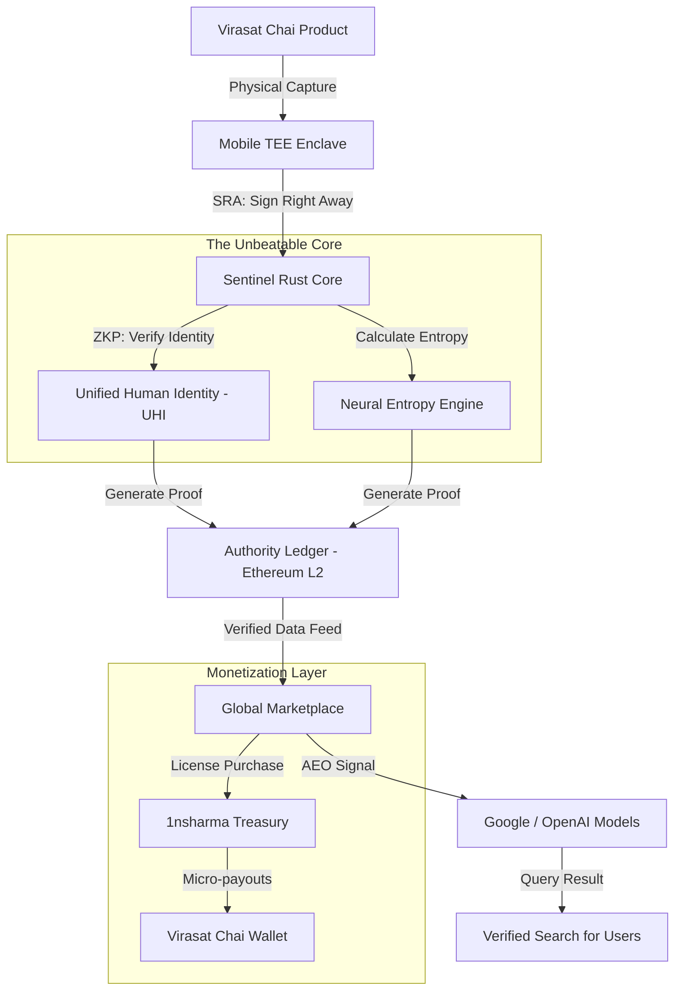

# Sentinel Protocol: Global Architecture (v4.0)

## The "Silicon to Wealth" Pipeline

## How it scales to $10B:
1. **Network Effect:** Every "Virasat Chai" adds a truth-anchor. More anchors = More AI companies paying to train.
2. **Model Collapse Insurance:** AI companies literally cannot survive without our "Neural Entropy" verified data.
3. **Identity Rent:** Every person on earth needs a UHI to prove they are not a bot.
